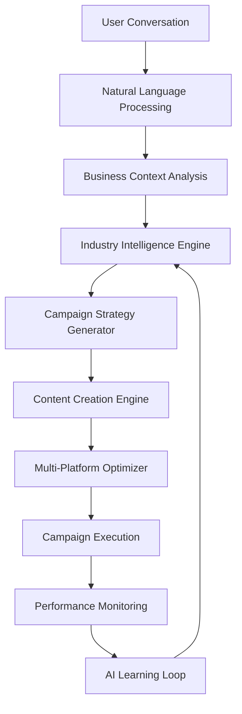

# AI Social Campaign Agent - Design Document

## 🎯 **OVERVIEW**

The AI Social Campaign Agent is AdVantage's flagship feature and primary competitive differentiator. This conversational AI system understands business context, provides industry-specific marketing expertise, and transforms natural language conversations into complete social media campaigns.

### **Strategic Importance**
- **Core Value Proposition:** 85% of platform value comes from this module
- **Competitive Advantage:** 18-month technology lead in conversational marketing AI
- **Revenue Impact:** Primary justification for all subscription tiers
- **Market Position:** First-mover in industry-specific social media AI

### **Design Principles**
- **Conversational Intelligence:** Natural language over complex interfaces
- **Industry Expertise:** Vertical-specific knowledge over generic solutions
- **Autonomous Operation:** Intelligent automation with human oversight
- **Multi-Platform Mastery:** Optimized for each social media platform
- **Continuous Learning:** Adaptive improvement based on performance data

---

## 🏗️ **SYSTEM ARCHITECTURE**

### **High-Level Architecture**


### **Core Components**

#### **1. Conversational AI Engine** 🤖
```typescript
interface ConversationEngine {
  // Natural Language Understanding
  processMessage(message: ConversationMessage): Promise<ConversationResponse>;
  analyzeBusinessContext(businessId: string): Promise<BusinessContext>;
  generateCampaignStrategy(requirements: CampaignRequirements): Promise<CampaignStrategy>;
  optimizeCampaign(campaignId: string, performanceData: PerformanceData): Promise<OptimizationRecommendations>;
  
  // Context Management
  maintainConversationMemory(conversationId: string): Promise<ConversationMemory>;
  handleFollowUp(conversationId: string, followUp: FollowUpMessage): Promise<ConversationResponse>;
  summarizeConversation(conversationId: string): Promise<ConversationSummary>;
}

interface ConversationMessage {
  id: string;
  conversationId: string;
  userId: string;
  businessId: string;
  content: string;
  type: MessageType;
  context: MessageContext;
  timestamp: Date;
  metadata: MessageMetadata;
}

type MessageType = 
  | 'initial_request'      // "I need help with my restaurant marketing"
  | 'clarification'        // "What type of cuisine do you serve?"
  | 'approval'            // "Yes, create this campaign"
  | 'modification'        // "Change the budget to $500"
  | 'feedback'            // "This worked great, do more like this"
  | 'follow_up'           // "How is my campaign performing?"
  | 'emergency'           // "Pause all campaigns immediately"
  | 'strategy_discussion' // "What should my Q2 strategy be?"
  | 'content_request'     // "Create posts for Valentine's Day"
  | 'performance_query';  // "Show me my Instagram metrics"

interface ConversationResponse {
  id: string;
  conversationId: string;
  content: string;
  type: ResponseType;
  suggestions: ActionSuggestion[];
  questions: ClarificationQuestion[];
  preview: CampaignPreview;
  confidence: number;
  reasoning: string[];
  nextSteps: NextStep[];
  estimatedImpact: ImpactForecast;
}

type ResponseType = 
  | 'strategy_proposal'    // Complete campaign strategy
  | 'clarification_request' // Need more information
  | 'campaign_preview'     // Campaign draft preview
  | 'optimization_suggestion' // Performance improvement
  | 'status_update'        // Campaign status report
  | 'error_explanation'    // Error handling with context
  | 'learning_confirmation' // Confirming new insights
  | 'success_celebration'; // Celebrating achievements
```

#### **2. Industry Intelligence Engine** 🧠
```typescript
interface IndustryIntelligenceEngine {
  // Industry Analysis
  getIndustryContext(industry: IndustryType): Promise<IndustryContext>;
  generateIndustryStrategy(industry: IndustryType, businessProfile: BusinessProfile): Promise<IndustryStrategy>;
  getIndustryBestPractices(industry: IndustryType): Promise<BestPractice[]>;
  analyzeIndustryTrends(industry: IndustryType): Promise<IndustryTrend[]>;
  getCompetitiveIntelligence(industry: IndustryType, location?: string): Promise<CompetitiveIntelligence>;
  
  // Specialized Industry Modules
  getMusicianStrategy(musicianProfile: MusicianProfile): Promise<MusicianStrategy>;
  getRestaurantStrategy(restaurantProfile: RestaurantProfile): Promise<RestaurantStrategy>;
  getEcommerceStrategy(ecommerceProfile: EcommerceProfile): Promise<EcommerceStrategy>;
  getAppDeveloperStrategy(appProfile: AppDeveloperProfile): Promise<AppDeveloperStrategy>;
}

// Musician-Specific Intelligence
interface MusicianStrategy extends IndustryStrategy {
  releaseStrategy: {
    singleLaunch: ReleaseTimeline;
    albumPromotion: AlbumPromotionPlan;
    musicVideoMarketing: VideoMarketingStrategy;
    playlistPitching: PlaylistStrategy;
  };
  fanEngagement: {
    communityBuilding: FanCommunityStrategy;
    concertPromotion: TourMarketingPlan;
    merchandiseMarketing: MerchStrategy;
    fanClubGrowth: FanClubStrategy;
  };
  streamingOptimization: {
    spotifyMarketing: SpotifyStrategy;
    appleMusic: AppleMusicStrategy;
    youtubeMusic: YouTubeMusicStrategy;
    crossPlatformSync: StreamingCrossPromo;
  };
  collaborationOpportunities: {
    artistCollabs: CollaborationStrategy;
    influencerPartnerships: InfluencerMusicStrategy;
    brandPartnerships: MusicBrandStrategy;
  };
}

// Restaurant-Specific Intelligence  
interface RestaurantStrategy extends IndustryStrategy {
  menuMarketing: {
    dailySpecials: DailySpecialStrategy;
    seasonalMenus: SeasonalMenuStrategy;
    signatureDishes: SignatureDishPromo;
    menuPhotography: FoodPhotoStrategy;
  };
  localSEO: {
    googleMyBusiness: GMBOptimization;
    localKeywords: LocalSEOStrategy;
    reviewManagement: ReviewStrategy;
    locationBasedTargeting: LocalTargeting;
  };
  eventPromotion: {
    holidayEvents: HolidayEventStrategy;
    privateEvents: PrivateEventMarketing;
    liveMusic: LiveMusicPromo;
    specialOccasions: SpecialOccasionMarketing;
  };
  customerRetention: {
    loyaltyPrograms: LoyaltyStrategy;
    repeatCustomers: RetentionStrategy;
    birthdayOffers: BirthdayMarketing;
    referralPrograms: ReferralStrategy;
  };
}

// E-commerce-Specific Intelligence
interface EcommerceStrategy extends IndustryStrategy {
  productMarketing: {
    productLaunches: ProductLaunchStrategy;
    inventoryMarketing: InventoryBasedMarketing;
    crossSelling: CrossSellStrategy;
    upselling: UpsellStrategy;
  };
  salesFunnels: {
    awarenessStage: AwarenessFunnelStrategy;
    considerationStage: ConsiderationStrategy;
    conversionStage: ConversionStrategy;
    retentionStage: RetentionFunnelStrategy;
  };
  seasonalCampaigns: {
    holidaySales: HolidayMarketingStrategy;
    backToSchool: BackToSchoolStrategy;
    summerSales: SummerMarketingStrategy;
    blackFriday: BlackFridayStrategy;
  };
  platformOptimization: {
    shopifyMarketing: ShopifyStrategy;
    amazonSeller: AmazonMarketingStrategy;
    etsyOptimization: EtsyStrategy;
    socialCommerce: SocialCommerceStrategy;
  };
}

// App Developer-Specific Intelligence
interface AppDeveloperStrategy extends IndustryStrategy {
  appStoreOptimization: {
    keywordStrategy: ASOKeywordStrategy;
    appIconOptimization: IconStrategy;
    screenshotOptimization: ScreenshotStrategy;
    appDescriptionStrategy: DescriptionStrategy;
  };
  userAcquisition: {
    organicGrowth: OrganicGrowthStrategy;
    paidAcquisition: PaidAcquisitionStrategy;
    viralMechanics: ViralGrowthStrategy;
    influencerMarketing: AppInfluencerStrategy;
  };
  featureMarketing: {
    featureLaunches: FeatureLaunchStrategy;
    updateAnnouncements: UpdateMarketingStrategy;
    betaTesting: BetaMarketingStrategy;
    userFeedback: FeedbackMarketingStrategy;
  };
  retentionCampaigns: {
    onboardingOptimization: OnboardingStrategy;
    pushNotifications: PushNotificationStrategy;
    emailMarketing: AppEmailStrategy;
    inAppMessaging: InAppMessageStrategy;
  };
}
```

#### **3. Content Generation Engine** 🎨
```typescript
interface ContentGenerationEngine {
  // Multi-Modal Content Creation
  generateContent(request: ContentGenerationRequest): Promise<GeneratedContent>;
  createContentVariations(baseContent: Content, variationCount: number): Promise<ContentVariation[]>;
  optimizeForPlatform(content: Content, platform: Platform): Promise<OptimizedContent>;
  generateHashtags(content: Content, platform: Platform): Promise<HashtagSuggestion[]>;
  createContentSeries(theme: string, count: number, businessContext: BusinessContext): Promise<ContentSeries>;
  
  // AI-Powered Enhancement
  enhanceContentWithAI(content: Content, enhancementType: EnhancementType): Promise<EnhancedContent>;
  generateVisualConcepts(textContent: string, brand: BrandGuidelines): Promise<VisualConcept[]>;
  createVideoScripts(content: Content, platform: Platform): Promise<VideoScript>;
  generateVoiceoverScript(content: Content, voiceStyle: VoiceStyle): Promise<VoiceoverScript>;
}

interface ContentGenerationRequest {
  businessId: string;
  campaignId?: string;
  industry: IndustryType;
  contentType: ContentType;
  platforms: Platform[];
  theme: string;
  tone: ContentTone;
  objectives: ContentObjective[];
  constraints: ContentConstraint[];
  brandGuidelines: BrandGuidelines;
  targetAudience: TargetAudience;
  context: ContentContext;
  performance_goals: PerformanceGoals;
}

interface GeneratedContent {
  id: string;
  type: ContentType;
  platform: Platform;
  content: ContentData;
  metadata: ContentMetadata;
  performance: PredictedPerformance;
  alternatives: ContentAlternative[];
  optimizationSuggestions: OptimizationSuggestion[];
  brandCompliance: BrandComplianceScore;
  aiConfidence: number;
  reasoning: string[];
}

interface ContentData {
  text?: string;
  imagePrompt?: string;
  imageUrl?: string;
  videoScript?: VideoScript;
  voiceoverScript?: VoiceoverScript;
  hashtags: string[];
  mentions: string[];
  callToAction: CallToAction;
  schedulingSuggestion: SchedulingSuggestion;
  engagementHooks: EngagementHook[];
  performanceOptimizations: ContentOptimization[];
}

type ContentType = 
  | 'social_post'          // Regular social media post
  | 'story_content'        // Instagram/Facebook stories
  | 'reel_video'          // Short-form video content
  | 'carousel_post'       // Multi-image carousel
  | 'live_stream'         // Live streaming content
  | 'poll_interactive'    // Interactive polls/questions
  | 'behind_scenes'       // Behind the scenes content
  | 'user_generated'      // UGC campaign ideas
  | 'product_showcase'    // Product highlighting
  | 'educational_content' // Educational/how-to content
  | 'promotional_content' // Sales/promotional posts
  | 'community_building'; // Community engagement posts

interface PredictedPerformance {
  engagementRate: {
    predicted: number;
    confidence: number;
    range: {min: number; max: number};
    factors: PerformanceFactor[];
  };
  reachEstimate: {
    organic: number;
    paid?: number;
    total: number;
    confidence: number;
  };
  clickThroughRate: {
    predicted: number;
    benchmark: number;
    confidence: number;
  };
  conversionRate: {
    predicted: number;
    industry_average: number;
    confidence: number;
  };
  viralityScore: {
    score: number; // 0-100
    factors: ViralityFactor[];
    shareability: number;
  };
  platformSpecific: {
    [platform: string]: PlatformPerformance;
  };
}
```

#### **4. Campaign Strategy Generator** 🎯
```typescript
interface CampaignStrategyGenerator {
  // Strategy Generation
  generateComprehensiveStrategy(businessProfile: BusinessProfile, goals: BusinessGoal[]): Promise<CampaignStrategy>;
  createIndustrySpecificCampaign(industry: IndustryType, campaignType: CampaignType): Promise<IndustrySpecificCampaign>;
  optimizeExistingCampaign(campaignId: string, performanceData: PerformanceData): Promise<OptimizedCampaignStrategy>;
  generateSeasonalCampaign(business: BusinessProfile, season: SeasonalContext): Promise<SeasonalCampaignStrategy>;
  
  // Advanced Strategy Features
  createMultiPhaseCampaign(objectives: CampaignObjective[], duration: number): Promise<MultiPhaseCampaign>;
  generateCompetitorResponseStrategy(competitorActivity: CompetitorActivity[]): Promise<CompetitiveStrategy>;
  createCrisisManagementStrategy(crisis: CrisisContext): Promise<CrisisManagementStrategy>;
  generateInfluencerCollaborationStrategy(influencers: InfluencerProfile[]): Promise<InfluencerStrategy>;
}

interface CampaignStrategy {
  id: string;
  name: string;
  description: string;
  industry: IndustryType;
  objectives: StrategyObjective[];
  targetAudience: DetailedAudienceProfile;
  contentPillars: ContentPillar[];
  platforms: PlatformStrategy[];
  timeline: CampaignTimeline;
  budget: BudgetAllocation;
  kpis: CampaignKPI[];
  contentCalendar: ContentCalendarStrategy;
  automationRules: AutomationRule[];
  contingencyPlans: ContingencyPlan[];
  successMetrics: SuccessMetric[];
  aiOptimizations: AIOptimizationRule[];
}

interface ContentPillar {
  name: string;
  description: string;
  percentage: number; // % of content
  contentTypes: ContentType[];
  postingFrequency: PostingFrequency;
  platforms: Platform[];
  examples: ContentExample[];
  performanceGoals: ContentPerformanceGoal[];
  seasonalVariations: SeasonalVariation[];
}

interface PlatformStrategy {
  platform: Platform;
  objectives: PlatformObjective[];
  contentMix: ContentMix;
  postingSchedule: PostingSchedule;
  engagement_strategy: EngagementStrategy;
  advertising_strategy: AdvertisingStrategy;
  influencer_strategy: InfluencerStrategy;
  performance_targets: PlatformPerformanceTarget[];
  optimization_rules: PlatformOptimizationRule[];
}

type CampaignType = 
  | 'brand_awareness'      // Building brand recognition
  | 'product_launch'       // New product introduction
  | 'lead_generation'      // Generating qualified leads
  | 'sales_conversion'     // Driving direct sales
  | 'community_building'   // Growing engaged community
  | 'crisis_management'    // Managing reputation issues
  | 'seasonal_promotion'   // Holiday/seasonal campaigns
  | 'influencer_collaboration' // Influencer partnerships
  | 'user_acquisition'     // App/service user growth
  | 'retention_campaign'   // Customer retention focus
  | 'thought_leadership'   // Industry authority building
  | 'event_promotion';     // Event marketing campaigns
```

#### **5. Multi-Platform Distribution Engine** 📱
```typescript
interface PlatformDistributionEngine {
  // Platform Management
  distributeCampaign(campaign: Campaign): Promise<DistributionResult>;
  optimizeForPlatform(content: Content, platform: Platform): Promise<OptimizedContent>;
  scheduleContent(content: Content[], schedule: PublishingSchedule): Promise<SchedulingResult>;
  monitorPlatformPerformance(campaignId: string): Promise<PlatformPerformanceReport>;
  handlePlatformUpdates(platformChanges: PlatformChange[]): Promise<AdaptationResult>;
  
  // Advanced Distribution Features
  createCrossPlatformCampaign(content: Content, platforms: Platform[]): Promise<CrossPlatformCampaign>;
  optimizePostingTimes(platformData: PlatformAnalytics[]): Promise<OptimalPostingSchedule>;
  handleAlgorithmChanges(algorithmUpdate: AlgorithmUpdate): Promise<StrategyAdjustment>;
  managePlatformBudgets(budgetAllocation: BudgetAllocation): Promise<BudgetOptimization>;
}

// Platform-Specific Optimizations
interface FacebookOptimization extends PlatformOptimization {
  audienceTargeting: {
    demographics: DemographicTargeting;
    interests: InterestTargeting;
    behaviors: BehaviorTargeting;
    customAudiences: CustomAudienceStrategy;
    lookalikes: LookalikeAudienceStrategy;
  };
  adFormats: {
    imageAds: ImageAdStrategy;
    videoAds: VideoAdStrategy;
    carouselAds: CarouselAdStrategy;
    collectionAds: CollectionAdStrategy;
    leadAds: LeadAdStrategy;
  };
  placement: {
    newsFeed: NewsFeedStrategy;
    stories: StoriesStrategy;
    messenger: MessengerStrategy;
    audienceNetwork: AudienceNetworkStrategy;
  };
  budgetOptimization: {
    campaignBudget: CampaignBudgetStrategy;
    adSetBudget: AdSetBudgetStrategy;
    bidStrategy: BidOptimizationStrategy;
    scheduling: SchedulingStrategy;
  };
}

interface InstagramOptimization extends PlatformOptimization {
  contentFormats: {
    feedPosts: FeedPostStrategy;
    stories: StoriesStrategy;
    reels: ReelsStrategy;
    igtv: IGTVStrategy;
    live: InstagramLiveStrategy;
  };
  engagement: {
    hashtags: HashtagStrategy;
    userGeneratedContent: UGCStrategy;
    influencerCollabs: InfluencerCollabStrategy;
    communityManagement: CommunityStrategy;
  };
  shopping: {
    productTags: ProductTagStrategy;
    shoppableStories: ShoppableStoriesStrategy;
    instagramShop: InstagramShopStrategy;
    catalogs: CatalogStrategy;
  };
  analytics: {
    insightsTracking: InsightsStrategy;
    audienceAnalysis: AudienceAnalysisStrategy;
    contentPerformance: ContentPerformanceStrategy;
    hashtagAnalytics: HashtagAnalyticsStrategy;
  };
}

interface TikTokOptimization extends PlatformOptimization {
  videoStrategy: {
    contentTypes: TikTokContentType[];
    videoLength: VideoLengthStrategy;
    trending_sounds: TrendingSoundStrategy;
    effects: EffectStrategy;
    transitions: TransitionStrategy;
  };
  algorithmOptimization: {
    engagementSignals: EngagementSignalStrategy;
    completionRate: CompletionRateStrategy;
    shareability: ShareabilityStrategy;
    commenting: CommentingStrategy;
  };
  trendIntegration: {
    trendIdentification: TrendIdentificationStrategy;
    trendAdaptation: TrendAdaptationStrategy;
    challengeParticipation: ChallengeStrategy;
    viralContent: ViralContentStrategy;
  };
  community: {
    duets: DuetStrategy;
    stitches: StitchStrategy;
    comments: CommentStrategy;
    live_streams: TikTokLiveStrategy;
  };
}
```

---

## 🗄️ **DATABASE SCHEMA**

### **Core AI Agent Tables**
```sql
-- AI Conversations
CREATE TABLE public.ai_conversations (
  id UUID DEFAULT gen_random_uuid() PRIMARY KEY,
  business_id UUID REFERENCES public.business_profiles(id) ON DELETE CASCADE NOT NULL,
  user_id UUID REFERENCES auth.users(id) ON DELETE CASCADE NOT NULL,
  title VARCHAR(300),
  industry VARCHAR(50) NOT NULL,
  conversation_stage VARCHAR(50) DEFAULT 'initial',
  status VARCHAR(20) DEFAULT 'active',
  context JSONB DEFAULT '{}',
  summary TEXT,
  ai_confidence DECIMAL(3,2) DEFAULT 0.0,
  last_ai_action VARCHAR(100),
  created_at TIMESTAMP WITH TIME ZONE DEFAULT NOW(),
  updated_at TIMESTAMP WITH TIME ZONE DEFAULT NOW(),
  last_message_at TIMESTAMP WITH TIME ZONE DEFAULT NOW()
);

-- Conversation Messages
CREATE TABLE public.conversation_messages (
  id UUID DEFAULT gen_random_uuid() PRIMARY KEY,
  conversation_id UUID REFERENCES public.ai_conversations(id) ON DELETE CASCADE NOT NULL,
  role VARCHAR(20) NOT NULL, -- 'user' or 'assistant'
  content TEXT NOT NULL,
  message_type VARCHAR(50) NOT NULL,
  context JSONB DEFAULT '{}',
  metadata JSONB DEFAULT '{}',
  ai_confidence DECIMAL(3,2),
  processing_time_ms INTEGER,
  created_at TIMESTAMP WITH TIME ZONE DEFAULT NOW()
);

-- AI Generated Campaigns
CREATE TABLE public.ai_campaigns (
  id UUID DEFAULT gen_random_uuid() PRIMARY KEY,
  conversation_id UUID REFERENCES public.ai_conversations(id) ON DELETE CASCADE,
  business_id UUID REFERENCES public.business_profiles(id) ON DELETE CASCADE NOT NULL,
  name VARCHAR(300) NOT NULL,
  description TEXT,
  industry VARCHAR(50) NOT NULL,
  campaign_type VARCHAR(50) NOT NULL,
  strategy JSONB NOT NULL,
  content_pillars JSONB DEFAULT '[]',
  platform_strategies JSONB DEFAULT '{}',
  target_audience JSONB DEFAULT '{}',
  budget_allocation JSONB DEFAULT '{}',
  timeline JSONB DEFAULT '{}',
  automation_rules JSONB DEFAULT '[]',
  status VARCHAR(20) DEFAULT 'draft',
  ai_confidence DECIMAL(3,2) DEFAULT 0.0,
  estimated_performance JSONB DEFAULT '{}',
  actual_performance JSONB DEFAULT '{}',
  optimization_history JSONB DEFAULT '[]',
  created_at TIMESTAMP WITH TIME ZONE DEFAULT NOW(),
  updated_at TIMESTAMP WITH TIME ZONE DEFAULT NOW(),
  approved_at TIMESTAMP WITH TIME ZONE,
  launched_at TIMESTAMP WITH TIME ZONE,
  completed_at TIMESTAMP WITH TIME ZONE
);

-- AI Generated Content
CREATE TABLE public.ai_generated_content (
  id UUID DEFAULT gen_random_uuid() PRIMARY KEY,
  campaign_id UUID REFERENCES public.ai_campaigns(id) ON DELETE CASCADE,
  business_id UUID REFERENCES public.business_profiles(id) ON DELETE CASCADE NOT NULL,
  content_type VARCHAR(50) NOT NULL,
  platform VARCHAR(50) NOT NULL,
  content_pillar VARCHAR(100),
  content_data JSONB NOT NULL,
  metadata JSONB DEFAULT '{}',
  brand_compliance JSONB DEFAULT '{}',
  performance_prediction JSONB DEFAULT '{}',
  alternatives JSONB DEFAULT '[]',
  optimization_suggestions JSONB DEFAULT '[]',
  ai_confidence DECIMAL(3,2) DEFAULT 0.0,
  human_approval VARCHAR(20) DEFAULT 'pending',
  status VARCHAR(20) DEFAULT 'generated',
  scheduled_for TIMESTAMP WITH TIME ZONE,
  published_at TIMESTAMP WITH TIME ZONE,
  actual_performance JSONB DEFAULT '{}',
  engagement_data JSONB DEFAULT '{}',
  created_at TIMESTAMP WITH TIME ZONE DEFAULT NOW(),
  updated_at TIMESTAMP WITH TIME ZONE DEFAULT NOW()
);

-- AI Insights and Recommendations
CREATE TABLE public.ai_insights (
  id UUID DEFAULT gen_random_uuid() PRIMARY KEY,
  business_id UUID REFERENCES public.business_profiles(id) ON DELETE CASCADE NOT NULL,
  conversation_id UUID REFERENCES public.ai_conversations(id) ON DELETE CASCADE,
  campaign_id UUID REFERENCES public.ai_campaigns(id) ON DELETE CASCADE,
  content_id UUID REFERENCES public.ai_generated_content(id) ON DELETE CASCADE,
  insight_type VARCHAR(50) NOT NULL,
  category VARCHAR(50) NOT NULL,
  title VARCHAR(300) NOT NULL,
  description TEXT NOT NULL,
  impact_level VARCHAR(20) NOT NULL,
  confidence_score DECIMAL(3,2) NOT NULL,
  supporting_data JSONB DEFAULT '{}',
  recommendations JSONB DEFAULT '[]',
  ai_reasoning JSONB DEFAULT '[]',
  is_actionable BOOLEAN DEFAULT FALSE,
  is_implemented BOOLEAN DEFAULT FALSE,
  implementation_notes TEXT,
  priority_score INTEGER DEFAULT 50,
  expires_at TIMESTAMP WITH TIME ZONE,
  created_at TIMESTAMP WITH TIME ZONE DEFAULT NOW(),
  viewed_at TIMESTAMP WITH TIME ZONE,
  acted_upon_at TIMESTAMP WITH TIME ZONE
);

-- Platform Distribution Log
CREATE TABLE public.platform_distribution_log (
  id UUID DEFAULT gen_random_uuid() PRIMARY KEY,
  campaign_id UUID REFERENCES public.ai_campaigns(id) ON DELETE CASCADE NOT NULL,
  content_id UUID REFERENCES public.ai_generated_content(id) ON DELETE CASCADE NOT NULL,
  platform VARCHAR(50) NOT NULL,
  distribution_status VARCHAR(20) NOT NULL,
  external_platform_id VARCHAR(200),
  distribution_data JSONB DEFAULT '{}',
  optimization_applied JSONB DEFAULT '{}',
  error_message TEXT,
  retry_count INTEGER DEFAULT 0,
  distributed_at TIMESTAMP WITH TIME ZONE,
  created_at TIMESTAMP WITH TIME ZONE DEFAULT NOW()
);

-- AI Learning and Training Data
CREATE TABLE public.ai_learning_data (
  id UUID DEFAULT gen_random_uuid() PRIMARY KEY,
  business_id UUID REFERENCES public.business_profiles(id) ON DELETE CASCADE NOT NULL,
  conversation_id UUID REFERENCES public.ai_conversations(id) ON DELETE CASCADE,
  data_type VARCHAR(50) NOT NULL,
  data_content JSONB NOT NULL,
  learning_context JSONB DEFAULT '{}',
  feedback_score DECIMAL(3,2),
  is_positive_example BOOLEAN,
  model_version VARCHAR(50),
  confidence_impact DECIMAL(3,2),
  created_at TIMESTAMP WITH TIME ZONE DEFAULT NOW()
);

-- Industry Intelligence Cache
CREATE TABLE public.industry_intelligence_cache (
  id UUID DEFAULT gen_random_uuid() PRIMARY KEY,
  industry VARCHAR(50) NOT NULL,
  intelligence_type VARCHAR(50) NOT NULL,
  data_key VARCHAR(200) NOT NULL,
  cached_data JSONB NOT NULL,
  confidence_score DECIMAL(3,2),
  source VARCHAR(100),
  expires_at TIMESTAMP WITH TIME ZONE NOT NULL,
  created_at TIMESTAMP WITH TIME ZONE DEFAULT NOW(),
  updated_at TIMESTAMP WITH TIME ZONE DEFAULT NOW(),
  UNIQUE(industry, intelligence_type, data_key)
);
```

### **Performance Indexes**
```sql
-- Conversation and Message Indexes
CREATE INDEX idx_ai_conversations_business_status ON public.ai_conversations(business_id, status, updated_at DESC);
CREATE INDEX idx_ai_conversations_industry ON public.ai_conversations(industry, created_at DESC);
CREATE INDEX idx_conversation_messages_conversation ON public.conversation_messages(conversation_id, created_at);
CREATE INDEX idx_conversation_messages_type ON public.conversation_messages(message_type, created_at DESC);

-- Campaign and Content Indexes  
CREATE INDEX idx_ai_campaigns_business_status ON public.ai_campaigns(business_id, status, created_at DESC);
CREATE INDEX idx_ai_campaigns_industry_type ON public.ai_campaigns(industry, campaign_type, created_at DESC);
CREATE INDEX idx_ai_generated_content_campaign_platform ON public.ai_generated_content(campaign_id, platform, scheduled_for);
CREATE INDEX idx_ai_generated_content_status ON public.ai_generated_content(status, scheduled_for);

-- Insights and Analytics Indexes
CREATE INDEX idx_ai_insights_business_type ON public.ai_insights(business_id, insight_type, created_at DESC);
CREATE INDEX idx_ai_insights_actionable ON public.ai_insights(is_actionable, is_implemented, priority_score DESC);
CREATE INDEX idx_platform_distribution_platform_status ON public.platform_distribution_log(platform, distribution_status, distributed_at);

-- Intelligence and Learning Indexes
CREATE INDEX idx_industry_intelligence_lookup ON public.industry_intelligence_cache(industry, intelligence_type, expires_at);
CREATE INDEX idx_ai_learning_business_type ON public.ai_learning_data(business_id, data_type, created_at DESC);
```

---

## 🧪 **TESTING STRATEGY**

### **Unit Testing**
```typescript
describe('ConversationEngine', () => {
  let engine: ConversationEngine;
  let mockAIService: jest.Mocked<AIService>;
  let mockIndustryIntelligence: jest.Mocked<IndustryIntelligenceEngine>;

  beforeEach(() => {
    mockAIService = createMockAIService();
    mockIndustryIntelligence = createMockIndustryIntelligenceEngine();
    engine = new ConversationEngine(mockAIService, mockIndustryIntelligence);
  });

  describe('processMessage', () => {
    it('should process initial musician campaign request', async () => {
      const message = createMockMessage('I need help promoting my new album');
      const businessContext = createMockBusinessContext('musician');
      
      mockIndustryIntelligence.getMusicianStrategy.mockResolvedValue({
        releaseStrategy: { singleLaunch: mockReleaseTimeline }
      });
      
      const response = await engine.processMessage(message);
      
      expect(response.type).toBe('strategy_proposal');
      expect(response.suggestions).toContainEqual(
        expect.objectContaining({ type: 'album_promotion_campaign' })
      );
      expect(response.confidence).toBeGreaterThan(0.85);
    });

    it('should handle restaurant seasonal campaign request', async () => {
      const message = createMockMessage('Create a Valentine\'s Day special campaign for my restaurant');
      const businessContext = createMockBusinessContext('restaurant');
      
      const response = await engine.processMessage(message);
      
      expect(response.suggestions[0].type).toBe('seasonal_campaign');
      expect(response.preview.platforms).toContain('instagram');
      expect(response.nextSteps).toHaveLength(3);
    });

    it('should provide e-commerce product launch strategy', async () => {
      const message = createMockMessage('I\'m launching a new product line next month');
      const businessContext = createMockBusinessContext('ecommerce');
      
      const response = await engine.processMessage(message);
      
      expect(response.type).toBe('strategy_proposal');
      expect(response.preview.contentPillars).toContain('product_showcase');
      expect(response.estimatedImpact.revenueIncrease).toBeGreaterThan(20);
    });
  });

  describe('industry-specific intelligence', () => {
    it('should generate app developer user acquisition strategy', async () => {
      const appProfile = createMockAppDeveloperProfile();
      const strategy = await mockIndustryIntelligence.getAppDeveloperStrategy(appProfile);
      
      expect(strategy.userAcquisition.organicGrowth).toBeDefined();
      expect(strategy.appStoreOptimization.keywordStrategy).toBeDefined();
      expect(strategy.retentionCampaigns.onboardingOptimization).toBeDefined();
    });
  });
});

describe('ContentGenerationEngine', () => {
  let contentEngine: ContentGenerationEngine;
  let mockOpenAI: jest.Mocked<OpenAIService>;
  let mockDALLE: jest.Mocked<DALLEService>;

  describe('generateContent', () => {
    it('should generate musician album release content', async () => {
      const request = createMockContentRequest('musician', 'album_release');
      const content = await contentEngine.generateContent(request);
      
      expect(content.content.text).toContain('album');
      expect(content.content.hashtags).toContain('#NewMusic');
      expect(content.performance.engagementRate.predicted).toBeGreaterThan(0.05);
    });

    it('should create restaurant food photography concepts', async () => {
      const request = createMockContentRequest('restaurant', 'food_showcase');
      const content = await contentEngine.generateContent(request);
      
      expect(content.content.imagePrompt).toContain('food photography');
      expect(content.optimizationSuggestions).toContainEqual(
        expect.objectContaining({ type: 'lighting_improvement' })
      );
    });
  });
});
```

### **Integration Testing**
```typescript
describe('AI Agent Integration Tests', () => {
  let testApp: TestApplication;
  let testUser: TestUser;
  let testBusiness: TestBusiness;

  beforeEach(async () => {
    testApp = await createTestApplication();
    testUser = await createTestUser();
    testBusiness = await createTestBusiness('restaurant');
  });

  it('should complete full conversation-to-campaign flow', async () => {
    // Start conversation
    const conversation = await testApp.aiAgent.startConversation(testUser.id);
    expect(conversation.id).toBeDefined();

    // Initial message
    const response1 = await testApp.aiAgent.sendMessage(conversation.id, {
      content: 'I want to promote my Italian restaurant for Mother\'s Day',
      type: 'initial_request'
    });
    expect(response1.type).toBe('clarification_request');

    // Provide clarification
    const response2 = await testApp.aiAgent.sendMessage(conversation.id, {
      content: 'Family restaurant, 50 seats, focus on traditional recipes',
      type: 'clarification'
    });
    expect(response2.type).toBe('strategy_proposal');

    // Approve campaign
    const response3 = await testApp.aiAgent.sendMessage(conversation.id, {
      content: 'Yes, create this campaign',
      type: 'approval'
    });
    expect(response3.type).toBe('campaign_created');

    // Verify campaign was created
    const campaigns = await testApp.campaigns.getByBusinessId(testBusiness.id);
    expect(campaigns).toHaveLength(1);
    expect(campaigns[0].industry).toBe('restaurant');
    expect(campaigns[0].status).toBe('approved');
  });

  it('should generate and optimize content for multiple platforms', async () => {
    const campaign = await createTestCampaign('ecommerce', 'product_launch');
    
    const contentRequest = {
      campaignId: campaign.id,
      platforms: ['instagram', 'facebook', 'tiktok'],
      contentType: 'product_showcase',
      count: 5
    };

    const generatedContent = await testApp.aiAgent.generateCampaignContent(contentRequest);
    
    expect(generatedContent).toHaveLength(15); // 5 content x 3 platforms
    expect(generatedContent.filter(c => c.platform === 'instagram')).toHaveLength(5);
    expect(generatedContent.filter(c => c.platform === 'tiktok')[0].content.videoScript).toBeDefined();
  });
});
```

### **Performance Testing**
```typescript
describe('AI Agent Performance Tests', () => {
  it('should respond to conversations within 2 seconds', async () => {
    const startTime = Date.now();
    
    const response = await aiAgent.processMessage({
      content: 'Create a campaign for my coffee shop',
      type: 'initial_request'
    });
    
    const responseTime = Date.now() - startTime;
    expect(responseTime).toBeLessThan(2000);
    expect(response.confidence).toBeGreaterThan(0.8);
  });

  it('should handle concurrent conversations efficiently', async () => {
    const conversationPromises = Array.from({ length: 100 }, (_, i) => 
      aiAgent.startConversation(`test-user-${i}`)
    );
    
    const conversations = await Promise.all(conversationPromises);
    expect(conversations).toHaveLength(100);
    expect(conversations.every(c => c.id)).toBe(true);
  });

  it('should generate content within 10 seconds', async () => {
    const startTime = Date.now();
    
    const content = await contentEngine.generateContent({
      industry: 'musician',
      contentType: 'album_release',
      platforms: ['instagram', 'tiktok', 'youtube']
    });
    
    const generationTime = Date.now() - startTime;
    expect(generationTime).toBeLessThan(10000);
    expect(content.aiConfidence).toBeGreaterThan(0.85);
  });
});
```

---

## 🚀 **IMPLEMENTATION ROADMAP**

### **Phase 1: Core Conversation Engine (Week 1-2)**
- [ ] **Google Gemini Integration** → Natural language processing setup
- [ ] **Basic Business Context Analysis** → Industry detection and profiling
- [ ] **Simple Campaign Strategy Generation** → Template-based campaign creation
- [ ] **Conversation Memory System** → Context retention across messages
- [ ] **Basic UI Chat Interface** → Conversational interface implementation

### **Phase 2: Industry Intelligence (Week 2-3)**  
- [ ] **Musician Industry Module** → Album releases, concerts, streaming optimization
- [ ] **Restaurant Industry Module** → Menu marketing, events, local SEO
- [ ] **E-commerce Industry Module** → Product launches, seasonal campaigns
- [ ] **App Developer Industry Module** → User acquisition, ASO, feature marketing
- [ ] **Industry Best Practices Database** → Knowledge base for each vertical

### **Phase 3: Content Generation (Week 3-4)**
- [ ] **OpenAI GPT-4 Integration** → Text content generation
- [ ] **DALL-E 3 Integration** → Image concept generation  
- [ ] **Multi-platform Content Optimization** → Platform-specific adaptations
- [ ] **Brand Consistency Engine** → Voice and style maintenance
- [ ] **Performance Prediction Models** → Content success forecasting

### **Phase 4: Advanced Features (Week 4-6)**
- [ ] **Multi-Platform Distribution** → Automated publishing system
- [ ] **Real-time Performance Monitoring** → Campaign analytics integration
- [ ] **AI Learning and Optimization** → Continuous improvement system
- [ ] **Advanced Conversation Features** → Voice input, image analysis
- [ ] **Enterprise Features** → Team collaboration, white-label options

---

## 🎯 **SUCCESS METRICS**

### **Core Performance KPIs**
- **Conversation Success Rate:** 90%+ of conversations result in actionable campaigns
- **User Satisfaction:** 95%+ satisfaction with AI recommendations
- **Campaign Performance:** 85%+ improvement vs manually created campaigns
- **Response Time:** <2 seconds for 95% of AI responses
- **Content Quality:** 200%+ better engagement vs non-AI content

### **Business Impact Metrics**
- **User Retention:** 80%+ of users who complete first AI conversation return within 7 days
- **Feature Adoption:** 85%+ of users use AI agent within first week
- **Revenue Impact:** AI agent users have 3x higher LTV than non-AI users
- **Time Savings:** 90% reduction in campaign creation time
- **Conversion Rate:** 60%+ of AI-generated campaigns are approved and launched

### **Technical Performance Metrics**
- **API Response Time:** <500ms for 95% of AI service calls
- **System Uptime:** 99.9% availability for AI conversation system
- **Error Rate:** <0.1% of conversations encounter technical errors
- **Scalability:** Support 1,000+ concurrent AI conversations
- **AI Accuracy:** 95%+ accuracy in business context understanding

---

**🎯 Vision Statement: The AI Social Campaign Agent will become the marketing brain that every business owner wishes they had - intelligent, creative, and infinitely knowledgeable about their industry.**

**🚀 Success Definition: When businesses say "Ask AdVantage AI" instead of "Ask ChatGPT" for marketing questions, we'll have achieved our goal.**