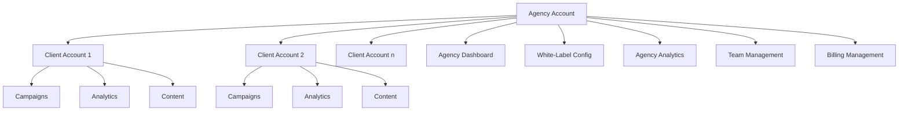
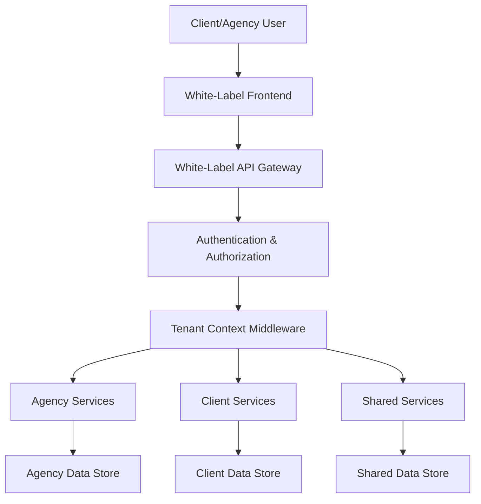
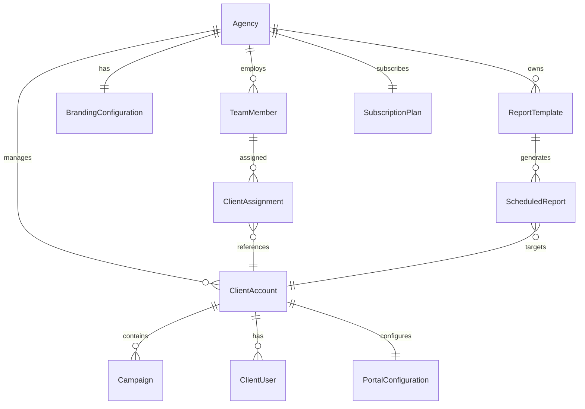

# Design Document: White-Label & Agency Tools

## Overview

The White-Label & Agency Tools feature will transform the AdVantage platform into a comprehensive agency management solution, enabling marketing agencies to rebrand the platform with their own identity, manage multiple client accounts efficiently, and provide customized client access. This design document outlines the architecture, components, data models, and implementation strategy for this feature.

The solution will be built on top of the existing AdVantage platform, extending its capabilities to support multi-tenant architecture with proper data isolation, customizable branding, and agency-specific workflows. The design prioritizes scalability, security, and a seamless user experience for both agencies and their clients.

## Architecture

### High-Level Architecture

The White-Label & Agency Tools feature will follow a multi-tenant architecture with a hierarchical structure:



### System Architecture

The White-Label & Agency Tools feature will be implemented using the following architectural approach:

1. **Multi-Tenant Data Model**: Extend the existing data model to support hierarchical relationships between agency accounts and client accounts.

2. **Dynamic Theming System**: Implement a theme provider that dynamically applies agency-specific branding across the platform.

3. **Permission-Based Access Control**: Enhance the authentication and authorization system to support role-based access control at both agency and client levels.

4. **Aggregated Analytics Engine**: Create a data aggregation layer that can process and combine analytics across multiple client accounts.

5. **White-Label API Gateway**: Implement API endpoints that respect tenant isolation and apply appropriate branding.



## Components and Interfaces

### 1. White-Label Configuration Module

**Purpose**: Enables agencies to customize the platform's branding and appearance.

**Key Components**:
- **BrandingConfigurationService**: Manages storage and retrieval of branding assets and settings
- **ThemeProvider**: Applies custom theming across the application
- **AssetManager**: Handles upload, storage, and delivery of custom assets (logos, images)

**Interfaces**:
```typescript
interface IBrandingConfiguration {
  logoUrl: string;
  favicon: string;
  primaryColor: string;
  secondaryColor: string;
  accentColor: string;
  fontFamily: string;
  customCss?: string;
  emailTemplate: EmailTemplateConfig;
  portalUrl: string;
}

interface IWhiteLabelConfigurationService {
  getBrandingForAgency(agencyId: string): Promise<IBrandingConfiguration>;
  updateBrandingConfiguration(agencyId: string, config: Partial<IBrandingConfiguration>): Promise<void>;
  uploadBrandingAsset(agencyId: string, assetType: AssetType, file: File): Promise<string>;
  previewBrandingChanges(agencyId: string, config: Partial<IBrandingConfiguration>): Promise<PreviewResult>;
}
```

### 2. Agency Dashboard Module

**Purpose**: Provides a centralized view for agencies to manage all client accounts.

**Key Components**:
- **AgencyDashboardService**: Aggregates data across client accounts
- **ClientManagementService**: Handles CRUD operations for client accounts
- **AgencyAnalyticsService**: Processes cross-client analytics

**Interfaces**:
```typescript
interface IAgencyDashboard {
  clientSummaries: ClientSummary[];
  performanceMetrics: AgencyPerformanceMetrics;
  recentActivities: Activity[];
  alerts: Alert[];
}

interface IClientManagementService {
  createClientAccount(agencyId: string, clientData: ClientCreationData): Promise<ClientAccount>;
  updateClientAccount(clientId: string, updates: Partial<ClientAccount>): Promise<ClientAccount>;
  archiveClientAccount(clientId: string): Promise<void>;
  listClientAccounts(agencyId: string, filters?: ClientListFilters): Promise<PaginatedResult<ClientAccount>>;
  switchToClientContext(clientId: string): Promise<ClientContext>;
}
```

### 3. Client Portal Module

**Purpose**: Provides a restricted view of the platform for agency clients.

**Key Components**:
- **ClientPortalService**: Manages client-specific views and access
- **PortalPermissionService**: Handles granular feature access for clients
- **ClientNotificationService**: Manages client communications

**Interfaces**:
```typescript
interface IClientPortal {
  availableFeatures: FeatureAccess[];
  campaigns: CampaignSummary[];
  analytics: ClientAnalytics;
  notifications: Notification[];
}

interface IPortalPermissionService {
  getClientPermissions(clientId: string): Promise<PermissionSet>;
  updateClientPermissions(clientId: string, permissions: Partial<PermissionSet>): Promise<PermissionSet>;
  checkPermission(clientId: string, feature: Feature): Promise<boolean>;
}
```

### 4. White-Label Reporting Module

**Purpose**: Generates branded reports and analytics for agencies and clients.

**Key Components**:
- **ReportTemplateService**: Manages customizable report templates
- **ReportGenerationService**: Creates branded reports in various formats
- **ReportSchedulingService**: Handles automated report delivery

**Interfaces**:
```typescript
interface IReportTemplate {
  id: string;
  name: string;
  description: string;
  sections: ReportSection[];
  brandingOptions: ReportBrandingOptions;
  isDefault: boolean;
}

interface IReportGenerationService {
  generateReport(templateId: string, parameters: ReportParameters): Promise<Report>;
  exportReport(reportId: string, format: ExportFormat): Promise<ExportResult>;
  scheduleReport(templateId: string, schedule: ReportSchedule): Promise<ScheduledReport>;
  addCommentaryToReport(reportId: string, commentary: ReportCommentary): Promise<Report>;
}
```

### 5. Agency Billing Module

**Purpose**: Manages subscription and billing for agency and client accounts.

**Key Components**:
- **AgencyBillingService**: Handles agency-level billing and subscriptions
- **ClientBillingService**: Manages client-specific billing
- **InvoiceGenerationService**: Creates branded invoices

**Interfaces**:
```typescript
interface IAgencyBilling {
  subscriptionTier: SubscriptionTier;
  clientAccounts: ClientBillingSummary[];
  billingHistory: BillingTransaction[];
  paymentMethods: PaymentMethod[];
}

interface IAgencyBillingService {
  getAgencyBillingSummary(agencyId: string): Promise<AgencyBillingSummary>;
  updateSubscription(agencyId: string, tier: SubscriptionTier): Promise<SubscriptionUpdateResult>;
  applyClientDiscount(clientId: string, discountData: DiscountData): Promise<void>;
  generateInvoice(agencyId: string, billingPeriod: BillingPeriod): Promise<Invoice>;
}
```

### 6. Agency Team Management Module

**Purpose**: Manages team members and their access to client accounts.

**Key Components**:
- **TeamManagementService**: Handles team member CRUD operations
- **RolePermissionService**: Manages role-based permissions
- **TeamActivityService**: Tracks team member activities

**Interfaces**:
```typescript
interface ITeamMember {
  id: string;
  name: string;
  email: string;
  role: AgencyRole;
  clientAssignments: ClientAssignment[];
  status: TeamMemberStatus;
}

interface ITeamManagementService {
  addTeamMember(agencyId: string, memberData: TeamMemberCreationData): Promise<TeamMember>;
  updateTeamMember(memberId: string, updates: Partial<TeamMember>): Promise<TeamMember>;
  removeTeamMember(memberId: string): Promise<void>;
  assignTeamMemberToClient(memberId: string, clientId: string, role: ClientRole): Promise<ClientAssignment>;
  getTeamActivityLog(agencyId: string, filters?: ActivityLogFilters): Promise<PaginatedResult<ActivityLogEntry>>;
}
```

### 7. Mobile White-Label Module

**Purpose**: Extends white-labeling to the mobile application.

**Key Components**:
- **MobileBrandingService**: Applies agency branding to mobile app
- **MobileConfigSyncService**: Synchronizes branding between web and mobile
- **MobileNotificationService**: Handles branded push notifications

**Interfaces**:
```typescript
interface IMobileBranding {
  splashScreen: string;
  appIcon: string;
  navigationBarColor: string;
  notificationSettings: MobileNotificationSettings;
}

interface IMobileBrandingService {
  getMobileBrandingConfig(agencyId: string): Promise<MobileBrandingConfig>;
  updateMobileBrandingConfig(agencyId: string, config: Partial<MobileBrandingConfig>): Promise<MobileBrandingConfig>;
  syncWebToMobileBranding(agencyId: string): Promise<SyncResult>;
}
```

### 8. Agency Analytics Module

**Purpose**: Provides aggregated analytics across all client accounts.

**Key Components**:
- **AgencyAnalyticsService**: Aggregates and processes cross-client data
- **BenchmarkingService**: Compares performance across clients and industries
- **PerformanceAlertService**: Identifies underperforming accounts

**Interfaces**:
```typescript
interface IAgencyAnalytics {
  aggregatedMetrics: AggregatedMetrics;
  clientComparison: ClientComparisonData;
  performanceTrends: PerformanceTrend[];
  benchmarks: BenchmarkData[];
}

interface IAgencyAnalyticsService {
  getAgencyOverview(agencyId: string, timeframe: Timeframe): Promise<AgencyOverview>;
  compareClientPerformance(agencyId: string, metricType: MetricType): Promise<ClientComparisonResult>;
  setPerformanceBenchmarks(agencyId: string, benchmarks: BenchmarkSettings): Promise<void>;
  identifyUnderperformingClients(agencyId: string, threshold: number): Promise<UnderperformingClientResult[]>;
}
```

## Data Models

### Core Entity Relationships



### Key Data Models

#### Agency Model

```typescript
interface Agency {
  id: string;
  name: string;
  contactEmail: string;
  contactPhone: string;
  address: Address;
  createdAt: Date;
  updatedAt: Date;
  subscriptionTier: SubscriptionTier;
  subscriptionStatus: SubscriptionStatus;
  maxClients: number;
  maxTeamMembers: number;
  features: AgencyFeature[];
}
```

#### Branding Configuration Model

```typescript
interface BrandingConfiguration {
  agencyId: string;
  logoUrl: string;
  favicon: string;
  colorScheme: {
    primary: string;
    secondary: string;
    accent: string;
    background: string;
    text: string;
  };
  typography: {
    headingFont: string;
    bodyFont: string;
    fontSize: {
      base: string;
      heading1: string;
      heading2: string;
      heading3: string;
    };
  };
  emailTemplate: {
    headerLogoUrl: string;
    footerText: string;
    accentColor: string;
  };
  portalDomain: string;
  customCss: string;
  mobileConfig: MobileBrandingConfig;
  createdAt: Date;
  updatedAt: Date;
}
```

#### Client Account Model

```typescript
interface ClientAccount {
  id: string;
  agencyId: string;
  name: string;
  industry: IndustryType;
  contactEmail: string;
  contactPhone: string;
  address: Address;
  status: ClientStatus;
  portalEnabled: boolean;
  features: ClientFeature[];
  createdAt: Date;
  updatedAt: Date;
  archivedAt?: Date;
  billingTier: ClientBillingTier;
  customDiscount?: Discount;
}
```

#### Team Member Model

```typescript
interface TeamMember {
  id: string;
  agencyId: string;
  userId: string;
  role: AgencyRole;
  permissions: Permission[];
  clientAssignments: {
    clientId: string;
    role: ClientRole;
    permissions: Permission[];
  }[];
  status: TeamMemberStatus;
  createdAt: Date;
  updatedAt: Date;
  lastLoginAt?: Date;
}
```

#### Portal Configuration Model

```typescript
interface PortalConfiguration {
  clientId: string;
  enabled: boolean;
  accessibleFeatures: ClientFeature[];
  customWelcomeMessage: string;
  notificationSettings: {
    emailNotifications: boolean;
    reportFrequency: ReportFrequency;
    alertTypes: AlertType[];
  };
  users: {
    userId: string;
    role: ClientPortalRole;
    permissions: Permission[];
  }[];
  createdAt: Date;
  updatedAt: Date;
}
```

#### Report Template Model

```typescript
interface ReportTemplate {
  id: string;
  agencyId: string;
  name: string;
  description: string;
  isDefault: boolean;
  sections: {
    id: string;
    type: ReportSectionType;
    title: string;
    description: string;
    dataSource: DataSourceConfig;
    visualizationType: VisualizationType;
    order: number;
  }[];
  brandingOptions: {
    showLogo: boolean;
    coverPageTemplate: CoverPageTemplate;
    colorScheme: string;
    includeAgencyContact: boolean;
  };
  exportFormats: ExportFormat[];
  createdAt: Date;
  updatedAt: Date;
}
```

## Error Handling

### Error Categories

1. **Authentication & Authorization Errors**
   - Unauthorized access attempts
   - Permission boundary violations
   - Role conflicts

2. **Tenant Isolation Errors**
   - Cross-tenant data access attempts
   - Tenant context switching failures

3. **Branding Configuration Errors**
   - Invalid asset formats or dimensions
   - Theme application failures
   - Synchronization errors between web and mobile

4. **Billing & Subscription Errors**
   - Payment processing failures
   - Subscription limit violations
   - Discount application errors

5. **Client Management Errors**
   - Client creation/update failures
   - Archive/restore operation errors
   - Client limit exceeded errors

### Error Handling Strategy

1. **Centralized Error Handling**
   - Implement a global error handler that captures, logs, and responds to errors consistently
   - Use error codes and standardized error responses

2. **Tenant-Aware Error Logging**
   - Include tenant context in all error logs
   - Implement separate error streams for agency vs. client errors

3. **Graceful Degradation**
   - Implement fallbacks for branding failures (default to base theme)
   - Cache critical data to handle temporary service disruptions

4. **User-Friendly Error Messages**
   - Provide clear, actionable error messages for agency administrators
   - Customize error messages based on user role and context

5. **Error Monitoring & Alerting**
   - Set up real-time alerts for critical errors
   - Implement error rate monitoring with thresholds

## Testing Strategy

### Testing Levels

1. **Unit Testing**
   - Test individual components and services in isolation
   - Mock dependencies and external services
   - Focus on business logic and edge cases

2. **Integration Testing**
   - Test interactions between components
   - Verify proper data flow between services
   - Test tenant isolation mechanisms

3. **End-to-End Testing**
   - Simulate real user scenarios across the entire system
   - Test complete workflows from agency setup to client reporting
   - Verify white-label experience across platforms

4. **Visual Regression Testing**
   - Test branding application across the platform
   - Ensure consistent appearance across devices and screen sizes
   - Verify theme changes are applied correctly

### Test Scenarios

1. **Multi-Tenant Data Isolation**
   - Verify that agencies cannot access each other's data
   - Ensure clients can only access their own data
   - Test boundary conditions and edge cases

2. **White-Label Branding Application**
   - Test branding changes across all platform areas
   - Verify mobile app branding synchronization
   - Test fallback mechanisms when branding assets fail to load

3. **Permission and Access Control**
   - Test role-based access control for agency team members
   - Verify client portal permissions are enforced
   - Test permission changes and their immediate effects

4. **Agency-Client Workflows**
   - Test complete workflows from agency dashboard to client portal
   - Verify data consistency across views
   - Test notification and alert systems

5. **Billing and Subscription**
   - Test subscription changes and their effects on available features
   - Verify client limit enforcement
   - Test discount application and invoice generation

## Implementation Considerations

### Performance Optimization

1. **Efficient Multi-Tenant Queries**
   - Optimize database queries with proper indexing for tenant filtering
   - Implement query caching strategies for frequently accessed data
   - Use database sharding for large agency accounts if necessary

2. **Asset Delivery Optimization**
   - Use CDN for branding assets
   - Implement image optimization for logos and custom graphics
   - Cache theme configurations at the application level

3. **Aggregation Performance**
   - Implement efficient data aggregation for agency-level analytics
   - Use background processing for complex report generation
   - Consider materialized views for frequently accessed aggregated data

### Security Considerations

1. **Tenant Isolation**
   - Implement strict tenant context middleware
   - Audit all data access paths for potential isolation breaches
   - Use database-level row security where applicable

2. **Authentication & Authorization**
   - Implement JWT with tenant context
   - Use short-lived tokens with refresh mechanism
   - Implement IP-based restrictions for agency admin functions

3. **Asset Security**
   - Validate all uploaded assets for security vulnerabilities
   - Implement proper access controls for branding assets
   - Scan custom CSS for potential security issues

### Scalability Considerations

1. **Horizontal Scaling**
   - Design services to be stateless for easy horizontal scaling
   - Implement proper caching strategies to reduce database load
   - Use message queues for asynchronous processing

2. **Database Scaling**
   - Plan for database sharding by tenant
   - Implement read replicas for analytics and reporting queries
   - Consider separate databases for large agency accounts

3. **Resource Isolation**
   - Implement resource quotas per tenant
   - Monitor resource usage patterns
   - Implement throttling for high-volume API consumers

## Migration and Deployment Strategy

1. **Phased Rollout**
   - Start with core white-label functionality
   - Add agency management features incrementally
   - Gradually introduce advanced features like custom reporting

2. **Data Migration**
   - Develop migration scripts for existing accounts
   - Implement tenant ID backfill for existing data
   - Provide migration tools for agencies transitioning from competitor platforms

3. **Backward Compatibility**
   - Maintain API compatibility for existing integrations
   - Implement feature flags for gradual feature enablement
   - Provide migration guides for affected customers

4. **Monitoring and Rollback**
   - Implement comprehensive monitoring for the rollout
   - Prepare rollback procedures for each deployment phase
   - Set up alerting for unexpected behavior

## Conclusion

The White-Label & Agency Tools feature represents a significant enhancement to the AdVantage platform, enabling it to serve the agency market effectively. The design prioritizes tenant isolation, customization flexibility, and scalability to support agencies of various sizes. By implementing this feature, AdVantage will position itself as a comprehensive solution for marketing agencies looking to provide AI-powered social media management to their clients while maintaining their brand identity.

The modular approach to implementation will allow for phased development and deployment, with each component adding clear value to agency users. The multi-tenant architecture ensures proper data isolation and security, while the dynamic theming system provides a seamless branded experience across all touchpoints.